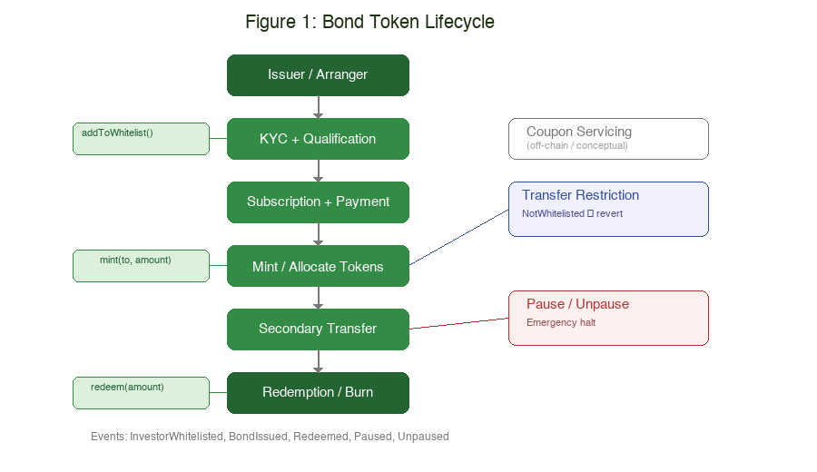

# Tokenising Green Bonds in Hong Kong: A Permissioned ERC-20 Prototype for Compliant Institutional Issuance

> Word count: ~2,220 (body text only; excludes references, appendix, implementation note blockquote, and figure captions)

---

## Introduction

Green bonds are among the fastest-growing fixed-income instruments, yet their issuance, distribution, and servicing remain fragmented across manual processes. This report examines whether tokenisation can improve the lifecycle efficiency of a HKD-denominated green bond targeting professional investors in Hong Kong. The analysis centres on a permissioned fungible token that embeds eligibility controls, transfer restrictions, and lifecycle logic into a smart contract. A proof-of-concept prototype, GreenBondToken, was deployed on an Ethereum testnet to validate these choices. The central argument is that tokenisation offers genuine operational benefits for institutional green bond issuance, but its success depends on legal recognition, market infrastructure, and regulatory clarity — not technology alone.

---

## 1. Asset Description and Value Source

The asset under consideration is a HKD-denominated green bond — a fixed-income security issued by a regulated institution in Hong Kong to finance projects with demonstrable environmental benefits. As a debt instrument, it confers on the bondholder a contractual right to periodic coupon payments and principal repayment at maturity. The economic value of the bond derives from the issuer's creditworthiness and commitment to repay, not from speculative market dynamics.

What distinguishes a green bond from a conventional bond is its use-of-proceeds constraint: the funds raised must be allocated to eligible green projects, such as renewable energy, clean transport, or climate adaptation infrastructure. This constraint is governed by frameworks such as the International Capital Market Association (ICMA) Green Bond Principles (ICMA, 2021), which require issuers to provide ongoing disclosure regarding fund allocation and environmental impact. The "green" label thus operates as a structural condition on the bond's proceeds, not a marketing attribute.

The token designed in this report represents a proportional claim on the bond's economic rights. Each token unit entitles the holder to a pro rata share of coupon income and principal repayment, mirroring the bondholder rights of a conventional instrument. Critically, the token does not create new financial rights or obligations; it digitises existing ones in a programmable format.

The choice of a fungible token (ERC-20) follows directly from the asset's economic properties. Green bonds are standardised debt instruments with uniform terms — every unit of a given issuance carries identical rights to coupon and principal. Unlike real estate or collectibles, where each unit may have unique attributes requiring non-fungible representation, bond units are inherently interchangeable. A fungible token is therefore the natural digital representation: it enables fractional holdings, straightforward balance tracking, and programmatic transfer among approved participants.

The bondholder rights embedded in the token include entitlement to coupon payments (administered off-chain by the issuer or servicing agent), principal repayment at maturity, and access to green disclosure reporting. These rights exist by virtue of the bond's legal documentation; the token serves as the on-chain record of ownership that facilitates their exercise.

---

## 2. Rationale for Tokenisation

Tokenising a green bond does not change its economic substance, but it addresses specific operational inefficiencies in how bonds are issued, transferred, and serviced.

First, investor onboarding can be streamlined. In traditional bond markets, eligibility verification (KYC/AML checks, accreditation status) is performed repeatedly by each intermediary. A whitelist-based model allows the issuer to record qualification status on-chain once and enforce it automatically at the token level. The smart contract rejects any transfer to a non-approved address, ensuring that only professional or qualified investors can hold the token at any point in the bond's lifecycle.

Second, transfer administration is simplified. Conventional bond transfers involve custodian messaging, reconciliation, and multi-day settlement. A tokenised bond can settle peer-to-peer between two whitelisted addresses in a single transaction, eliminating the need for centralised clearing and reducing administrative overhead. This is especially relevant for private placements and bilateral OTC trades, where existing processes are manual and slow.

Third, servicing transparency improves. Although coupon distribution is not implemented on-chain in this prototype, the immutable transaction history provides an auditable record of holdings over time — supporting regulatory reporting and green bond disclosure requirements.

Fourth, access enforcement becomes programmatic. The whitelist mechanism enforces investor eligibility at the infrastructure level. If a holder's accreditation lapses, the issuer removes them from the whitelist; subsequent transfers to that address revert automatically — a meaningful improvement over post-trade manual reconciliation.

However, it is essential to state clearly: tokenisation does not automatically create liquidity. A permissioned bond token traded among a limited pool of qualified investors will face the same demand-side constraints as its conventional equivalent. The operational benefits described above are real, but they should not be conflated with market depth or price discovery.

---

## 3. Token Structure and Design

The token is designed as a permissioned ERC-20 fungible token. Fungibility follows from the asset's economics: every unit of a bond issuance carries identical coupon and principal rights, making non-fungible representation unnecessary. The design embeds both economic rights and compliance controls into the token's on-chain logic.

**Economic rights.** Each token represents a proportional claim on the bond's cash flows. A holder owning 10% of the total supply is entitled to 10% of each coupon payment and 10% of the principal at maturity. Coupon entitlement is calculated off-chain by the servicing agent using on-chain balances as the authoritative ownership record — a snapshot of `balanceOf` at the record date determines each holder's share. This separation is deliberate: coupon calculation requires off-chain data (payment dates, day-count conventions), while ownership tracking benefits from on-chain immutability. The holder also retains access to green disclosure reporting under the applicable framework (ICMA, 2021).

**Compliance controls.** Five on-chain controls enforce the bond's regulatory requirements. (1) *Whitelist-based holding*: only issuer-approved addresses may receive tokens. (2) *Controlled issuance*: only the contract owner can mint, simulating regulated primary allocation. (3) *Restricted transfer*: transfers to non-whitelisted addresses revert with `NotWhitelisted`, ensuring tokens remain within the permissioned perimeter. (4) *Pause/unpause*: the owner can halt transfers for compliance or emergency reasons. (5) *Redemption/burn*: holders burn tokens to model the economic event of principal repayment — total supply decreases, reflecting that the issuer's obligation has been partially or fully discharged.

These controls are enforced through an override of ERC-20's `_update()` function, intercepting every token movement before execution. This ensures compliance cannot be bypassed by low-level calls.

**Lifecycle as financial process.** Each on-chain action maps to a real-world bond event: minting represents primary allocation of bond units to subscribers; transfer represents secondary sale of an existing position; burning represents the return of principal at maturity. The pause mechanism acts as a circuit breaker — equivalent to a trading halt in traditional markets (see Figure 1).

### Implementation Note

> A simplified proof-of-concept smart contract, GreenBondToken, was deployed on sepolia.
> Contract address: 0x1b48384Cb42a292975F4D4cD78D7EDa2A6F34F1E
> Explorer link: https://sepolia.etherscan.io/address/0x1b48384Cb42a292975F4D4cD78D7EDa2A6F34F1E
> GitHub repository: https://github.com/lucianw168/tokenised-green-bond-coursework
> The prototype demonstrates whitelist-based eligibility, controlled issuance, restricted transfer, pause, and redemption/burn.

The prototype is validated by eighteen automated tests and a full lifecycle demo with four wallets on a public testnet (Figures A1–A8).

---

## 4. Market Access and Liquidity Design

The market access model follows the lifecycle of a permissioned institutional issuance, from investor qualification through to secondary price formation.

**Onboarding and qualification.** Investors must complete KYC/AML verification and demonstrate status as professional or qualified investors under Hong Kong's Securities and Futures Ordinance (SFC, 2023). Upon clearance, the issuer adds the investor's address to the contract whitelist — a prerequisite for holding tokens at any stage.

**Primary issuance and pricing.** The bond is offered at a fixed spread over the relevant benchmark rate, consistent with institutional green bond practice. This is not an auction or bonding curve mechanism — those models suit assets with uncertain initial valuations, whereas a government-backed or investment-grade green bond prices off established credit curves. The issuer mints tokens to each subscriber's whitelisted address in proportion to their investment, creating an immutable on-chain record of primary allocation.

**Servicing.** Coupon payments are administered off-chain using on-chain balances as the authoritative entitlement record. A snapshot of `balanceOf` at each record date determines each holder's coupon share — a single auditable source replacing the multi-party reconciliation required in traditional custody chains.

**Secondary market structure.** Secondary trading occurs bilaterally between whitelisted holders, resembling an OTC bulletin board rather than an exchange. This is the appropriate market structure for a permissioned institutional bond: the participant pool is small (tens to hundreds, not thousands), and each trade requires counterparty identification. An automated market maker (AMM) is unsuitable because AMMs require continuous liquidity provision and assume open participation — both incompatible with a permissioned perimeter. A centralised order book is also impractical given the limited number of participants.

**Price formation and liquidity constraints.** Secondary pricing is driven by the bond's credit spread, prevailing interest rates, and the green premium — the yield concession investors accept for verified environmental impact. However, liquidity fragmentation is inherent: potential buyers are few, price discovery is limited, and there is no continuous market. Tokenisation improves transfer mechanics (atomic settlement, reduced intermediation) but does not expand the demand side. The framing is operational efficiency within an institutional context, not retail accessibility.

---

## 5. Risk Analysis and Limitations

Despite the operational benefits outlined above, several material risks could cause this design to fail. Each is analysed below with its failure cascade.

**Legal recognition risk.** If a Hong Kong court does not recognise on-chain token ownership as equivalent to traditional book-entry holding, the failure cascade is severe: holders cannot enforce coupon claims → the bond effectively becomes an unsecured digital record → institutional investors exit → the issuance model collapses. The SFC has provided guidance on security token offerings (SFC, 2023), but has not fully codified legal equivalence. Legal coherence between on-chain records and off-chain bond documentation is a prerequisite that technology cannot guarantee.

**Interoperability and settlement risk.** The prototype exists on a single blockchain, but production institutional actors operate across different chains, custodians, and settlement networks (DTCC and BCG, 2024). The failure scenario: a token transfer completes on-chain, but the corresponding fiat payment fails or is delayed off-chain → a delivery-versus-payment gap emerges → the buyer holds tokens without having paid, or the seller loses tokens without receiving funds → counterparty trust erodes → participants revert to traditional settlement, negating the tokenisation benefit. On-chain/off-chain misalignment and ambiguous settlement finality are structural risks in any hybrid system.

**Liquidity fragmentation risk.** A permissioned token can only trade among whitelisted holders, creating a structurally thin market. The failure scenario: a holder needs to exit their position → no whitelisted counterparty is willing to buy at a fair price → the holder is forced to hold to maturity or accept a steep discount → secondary market pricing becomes unreliable → new investors demand higher yields to compensate for illiquidity → issuance cost rises, undermining the economic rationale. This is not a technology deficiency but a consequence of the regulatory requirement for investor qualification.

**Compliance and control risk.** Administrative functions — whitelist management, minting, pausing — are controlled by a single owner key. The failure scenario: the key is compromised → an attacker mints unlimited tokens, diluting existing holders' claims → or pauses the contract indefinitely, freezing all positions → investors cannot exit or redeem → trust in the issuance collapses. Multi-signature governance and timelocked operations would mitigate this in production; the current prototype does not implement these safeguards.

**Smart contract and operational risk.** The prototype relies on OpenZeppelin's audited libraries (OpenZeppelin, 2024), but custom logic — particularly the `_update()` override — could contain bugs. The failure scenario: a flaw in the whitelist check allows tokens to escape the permissioned perimeter → regulatory breach → issuer liability → forced contract migration. Deployed contracts are immutable; a critical bug cannot be patched without deploying a new contract and migrating all state and balances — an operationally expensive and trust-damaging process.

---

## 6. Role of DeFi and Blockchain Infrastructure

Blockchain's contribution to this design is programmable infrastructure, not a replacement for traditional financial markets. It provides three concrete functions: a shared ownership ledger eliminating multi-custodian reconciliation; programmatic compliance enforcement embedded in execution logic rather than post-trade checks; and an immutable audit trail supporting regulatory reporting and green bond disclosure.

The relationship with DeFi protocols requires specific analysis. *Automated market makers* (Uniswap, Curve) are unsuitable: they assume open participation and continuous liquidity provision, both incompatible with a permissioned investor base. *Yield aggregators* conflict with the bond's fixed-income structure — coupon payments follow predetermined schedules, not variable DeFi yields. However, *institutional lending protocols* (such as permissioned forks of Aave) could in principle accept the token as repo-style collateral, enabling holders to borrow against their bond position without selling it. Similarly, the token's on-chain balance history could feed into *automated coupon calculation* systems, reducing servicing costs. These are realistic near-term applications that operate within, not against, the permissioned framework.

Blockchain is therefore an enabling layer for compliant financial operations. Its success in this context depends on legal recognition, institutional adoption, and interoperable market infrastructure — not on DeFi composability.

---

## Conclusion

The tokenisation of a HKD-denominated green bond offers genuine operational improvements in issuance efficiency, transfer administration, compliance enforcement, and servicing transparency. The ERC-20 fungible token is the appropriate digital form because the underlying asset — a standardised debt instrument with uniform terms — is inherently interchangeable across holders. The proof-of-concept prototype demonstrates that core lifecycle controls can be implemented and verified on a public testnet.

However, the viability of tokenised green bonds ultimately depends less on smart contract design and more on legal recognition of on-chain ownership, development of interoperable settlement infrastructure, and regulatory willingness to accommodate digital securities within existing frameworks. Technology is necessary, but not sufficient.

---

## References

1. ICMA (2021). *Green Bond Principles: Voluntary Process Guidelines for Issuing Green Bonds*. International Capital Market Association.
2. SFC (2023). *Circular on Security Token Offerings*. Securities and Futures Commission, Hong Kong.
3. HKMA (2024). *e-HKD and Digital Money*. Hong Kong Monetary Authority — regulatory guidance on digital asset frameworks.
4. DTCC and BCG (2024). *Digital Asset Securities: Building Blocks for a New Financial Market Infrastructure*. The Depository Trust & Clearing Corporation and Boston Consulting Group.
5. BIS (2023). *Tokenisation in the Context of Money and Other Assets: Concepts and Implications for Central Banks*. Bank for International Settlements, BIS Papers No 141.
6. OpenZeppelin (2024). *OpenZeppelin Contracts v5 Documentation*. https://docs.openzeppelin.com/contracts/5.x/
7. EIP-20 (2015). *ERC-20 Token Standard*. Ethereum Improvement Proposals. https://eips.ethereum.org/EIPS/eip-20

---

## Appendix: Screenshots and Evidence

See [GitHub repository](https://github.com/lucianw168/tokenised-green-bond-coursework) for full evidence, including:

- `screenshots/` — 13 lifecycle and verification screenshots (Figures A1–A13)
- `docs/evidence-matrix.md` — claim-to-evidence mapping
- `test/GreenBondToken.test.js` — 18 automated tests

| Figure | Description |
|---|---|
| A1 | Deployment success with contract address |
| A2 | Investor A whitelisted |
| A3 | Primary issuance (mint) to Investor A |
| A4 | Transfer to unapproved wallet reverts |
| A5 | Investor B whitelisted |
| A6 | Controlled secondary transfer A → B |
| A7 | Pause halts transfer |
| A8 | Redemption burns tokens, supply decreases |
| A9 | Etherscan verified source code |
| A10 | Etherscan source code detail |
| A11 | Etherscan transaction history |
| A12 | Etherscan HKGBT token page |
| A13 | MetaMask wallet showing HKGBT balance |
